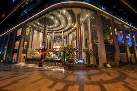

# Ex.06 Restaurant Website
## Date:

## AIM:
To develop a static Restaurant website to display the food items and services provided by them.

## DESIGN STEPS:

### Step 1:
Requirement collection.

### Step 2:
Creating the layout using HTML and CSS.

### Step 3:
Updating the sample content.

### Step 4:
Choose the appropriate style and color scheme.

### Step 5:
Validate the layout in various browsers.

### Step 6:
Validate the HTML code.

### Step 7:
Publish the website in Localhost.

## PROGRAM:
```
admin.html
<html>
<head>
    <title>Admin Panel</title>
    <link rel="stylesheet" href="admin.css">
</head>
<body>

<div class="main-box">

    <div class="nav-bar">
        <a href="home.html">HOME</a>
        <a href="menu.html">MENU</a>
        <a href="admin.html">ADMIN</a>
        <a href="contact.html">CONTACT</a>
    </div>

    <h1 class="title">OUR TEAM</h1>

    <div class="team-box">

        <div class="card">
            
            <h2>Saagar</h2>
            <p>CEO</p>
        </div>

        <div class="card">
            
            <h2>Virat Kohli</h2>
            <p>Marketing Manager</p>
        </div>

       

        <div class="card">
            
            <h2>AB de Villiers</h2>
            <p>HR Manager</p>
        </div>

        <div class="card">
            
            <h2>Sachin Tendulkar</h2>
            <p>Head Chef</p>
        </div>

    </div>

    <footer class="foot">©SAAGAR 212225040351 </footer>

</div>

</body>
</html>

admin.css
body {
    margin: 0;
}

.main-box {
    min-height: 100vh;
    display: flex;
    flex-direction: column;
    background-image: url(BEACH.jpg);
    background-size: cover;
    font-family: Arial;
}

.nav-bar {
    display: flex;
    justify-content: center;
    gap: 30px;
    background-color: white;
    padding: 12px;
    border-bottom: 2px solid black;
}

.nav-bar a {
    text-decoration: none;
    color: black;
}

.title {
    text-align: center;
    margin-top: 20px;
}

.team-box {
    display: grid;
    grid-template-columns: repeat(auto-fit, minmax(180px, 1fr));
    gap: 25px;
    padding: 30px;
}

.card {
    background-color: #e6d3a3;
    text-align: center;
    padding: 15px;
    border-radius: 10px;
}

.card img {
    width: 120px;
    height: 120px;
    border-radius: 50%;
    object-fit: cover;
}

.card h2 {
    margin: 10px 0 5px;
}

.foot {
    margin-top: auto;
    background-color: gray;
    text-align: center;
    padding: 10px;
}
home.html
<html>
<head>
    <title>Home</title>
    <link rel="stylesheet" href="home.css">
</head>
<body>

<div class="container">

    <div class="nav">
        <a href="home.html">HOME</a>
        <a href="menu.html">MENU</a>
        <a href="admin.html">ADMIN</a>
        <a href="contact.html">CONTACT</a>
    </div>

    <h1 class="name">ROYAL CHALLENGERS SPICE</h1>

    <h2 class="tag">Delicious Food, Happy Mood</h2>

    <p class="desc">
        Where every dish tells a story. Enjoy tasty food and great moments.
    </p>

    <div class="images">
        
        
    </div>

    <footer class="foot">© SAAGAR 212225040351</footer>

</div>

</body>
</html>

home.css
body {
    margin: 0;
}

.container {
    min-height: 100vh;
    display: flex;
    flex-direction: column;
    font-family: Arial;
}

.nav {
    display: flex;
    justify-content: center;
    gap: 30px;
    padding: 12px;
    background-color: #f0f0f0;
    border-bottom: 2px solid black;
}

.nav a {
    text-decoration: none;
    color: black;
}

.name {
    text-align: center;
    margin-top: 20px;
    font-size: 40px;
}

.tag {
    text-align: center;
    font-size: 24px;
}

.desc {
    text-align: center;
    width: 60%;
    margin: auto;
}

.images {
    display: flex;
    justify-content: center;
    gap: 20px;
    margin: 30px;
}

.images img {
    width: 300px;
    height: 180px;
    object-fit: cover;
}

.foot {
    margin-top: auto;
    background-color: gray;
    text-align: center;
    padding: 10px;
}

menu.html
<html>
<head>
    <title>Menu</title>
    <link rel="stylesheet" href="menu.css">
</head>
<body>

<div class="main">

    <div class="nav">
        <a href="home.html">HOME</a>
        <a href="menu.html">MENU</a>
        <a href="admin.html">ADMIN</a>
        <a href="contact.html">CONTACT</a>
    </div>

    <h1 class="heading">MENU</h1>

    <div class="menu-box">

        <div class="item">
            
            <h3>Lasagna</h3>
            <p>Rs.500</p>
        </div>

        <div class="item">
            
            <h3>Pizza</h3>
            <p>Rs.600</p>
        </div>

        <div class="item">
            
            <h3>Hot Chocolate</h3>
            <p>Rs.150</p>
        </div>

    </div>

    <footer class="foot">© SAAGAR 212225040351</footer>

</div>

</body>
</html>

menu.css
body {
    margin: 0;
}

.main {
    min-height: 100vh;
    display: flex;
    flex-direction: column;
    background-image: url(download.avif);
    background-size: cover;
    font-family: Arial;
}

.nav {
    display: flex;
    justify-content: center;
    gap: 30px;
    padding: 12px;
    background-color: white;
}

.nav a {
    text-decoration: none;
    color: black;
}

.heading {
    text-align: center;
    margin-top: 20px;
}

.menu-box {
    display: grid;
    grid-template-columns: repeat(auto-fit, minmax(200px, 1fr));
    gap: 30px;
    padding: 30px;
}

.item {
    background-color: #e8c0ea;
    padding: 15px;
    text-align: center;
    border-radius: 10px;
}

.item img {
    width: 100%;
    height: 150px;
    object-fit: cover;
}

.foot {
    margin-top: auto;
    background-color: gray;
    text-align: center;
    padding: 10px;
}

contact.html
<html>
<head>
    <title>Contact</title>
    <link rel="stylesheet" href="contact.css">
</head>
<body>

<div class="wrapper">

    <div class="nav">
        <a href="home.html">HOME</a>
        <a href="menu.html">MENU</a>
        <a href="admin.html">ADMIN</a>
        <a href="contact.html">CONTACT</a>
    </div>

    <h1 class="heading">CONTACT US</h1>

    <div class="contact-box">

        <div class="info">
            <h2>Get in Touch</h2>
            <p>Phone: 9361141424</p>
            <p>Email: kingkohli@gmail.com</p>
            <p>Location: Bangalore</p>
        </div>

        <div class="form-area">
            <h2>Send Message</h2>

            <input type="text" placeholder="Your Name">
            <input type="email" placeholder="Your Email">
            <textarea placeholder="Your Message"></textarea>
            <button>Submit</button>

        </div>

    </div>

    <footer class="foot">© SAAGAR 212225040351</footer>

</div>

</body>
</html>

contact.css
body {
    margin: 0;
}

.wrapper {
    min-height: 100vh;
    display: flex;
    flex-direction: column;
    font-family: Arial;
    background-color: #f5f5f5;
}

.nav {
    display: flex;
    justify-content: center;
    gap: 30px;
    padding: 12px;
    background-color: white;
    border-bottom: 2px solid black;
}

.nav a {
    text-decoration: none;
    color: black;
}

.heading {
    text-align: center;
    margin-top: 20px;
}

.contact-box {
    display: flex;
    justify-content: center;
    gap: 40px;
    padding: 30px;
    flex-wrap: wrap;
}

.info {
    background-color: #d9f0ff;
    padding: 20px;
    width: 250px;
    border-radius: 10px;
}

.form-area {
    background-color: #ffe0cc;
    padding: 20px;
    width: 300px;
    border-radius: 10px;
    display: flex;
    flex-direction: column;
    gap: 10px;
}

.form-area input,
.form-area textarea {
    padding: 8px;
    border: 1px solid gray;
}

.form-area textarea {
    height: 80px;
}

.form-area button {
    padding: 8px;
    background-color: black;
    color: white;
    border: none;
}

.foot {
    margin-top: auto;
    background-color: gray;
    text-align: center;
    padding: 10px;
}
```

## OUTPUT:
.png>) .png>) .png>) .png>)

## RESULT:
The program for designing software company website using HTML and CSS is completed successfully.
